# Welcome to JSmooCh

JSMooCh started as C ports of my emulators from JSMoo. It has since then expanded into more emulators. It is not really meant for the public to use - you need to recompile it to even change which files to open, and it only compiles on Mac OS X for now. I may work on the UI more in the future.

There is a fairly heavy emphasis on debugging, with cores offering different features as they make sense for a platform.

All the cores are in C11 so far. They should compile anywhere, although endianness is not accounted for. They all pretty much assume little-endian.

jsmooch-gui is the front-end GUI app.
jsmooch-lib is the C11 library of emulators, agnostic to front-end.
jsmooch-tests are some tests for jsmooch-lib

## jsmooch-gui progress
jsmooch-gui is very barebrones. It doesn't contain many QoL features I'd probably enjoy like a great debugger or even the ability to choose the ROM at run-time.

It's mostly there to look pretty sometimes. This is a project mostly for me.

## jsmooch-lib/core progress
The emulator cores, on the other hand, could be used by anybody! They all share a common interface based around describing the phyiscal I/O needed (no hardware-accelerated rendering, yet).

The emulators are not the fastest. The emphasis has been on making them "fast enough for me" while also being very accurate and easy to understand.

"Fast enough" comes into focus for the NDS, which, for now, runs >150FPS on my MacBook Air M2. There are plenty of opportunities to optimize older cores like GBA.

## Apple IIe
Won't boot. Just basic keyboard, ram, bus, etc. support. Needs work to boot.

## Atari 2600
Needs a lot of work, can't really play games. Mostly needs work on the TIA. Can kinda display a few like Frogger

## Dreamcast
Loads and plays homebrew, boots BIOS to the point of 3d commands. I never actually implemented the 3d commands, though.

## Galaksija
The Yugoslavian microcomputer from the 80's! Boots and displays properly. Not really tested beyond that, lacks tape support too.

## GameBoy/Color

Works, with sound, pretty well. A few incompatible GBC games, and a few with glitches but working, but mostly a competent core.

### Known issues
-Wario Land 3 - corrupt tiles

## GameBoy Advance

Works, with sound, pretty well. A fairl y competent core with decent accuracy.

### Known Issues
- No RTC, sun sensor, etc. yet
- Timing is good but not perfect, as is shown in GBA timing tests. Haven't gotten the prefetcher cycle penalty correct.
- MegaMan Zero 3 has some scroll issues

## Genesis/MegaDrive

Works, with decent sound, pretty well. I've tried over 70 games and gotten about 97% compatability (about 93% with no glitches whatsoever).

### Known issues
- Recent performance pass caused a small accuracy regression, this shouldn't be too hard to fix. Most games are unaffected, just a few demos.
- Devil's Crush shows some garbage tiles here and there in cutscenes
- The YM2612 emulation is...decent. It's not perfect. Most things sound good or great. Still trying to track down the cause

## Mac Classic
Boots to sad Mac. Needs work on floppies.

## NES
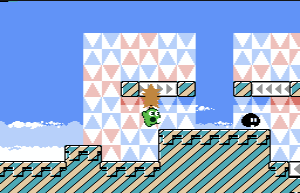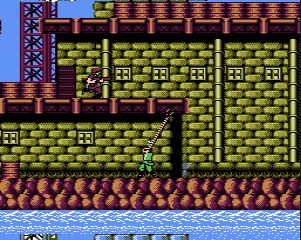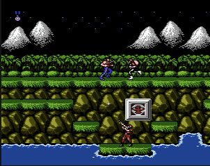

Pretty good compatability, with sound. Needs a little more work on sound to get it perfect (mostly Mario jump issues), and also MMC5 isn't great. Other than that games play nearly perfectly.

### Known issues
- MMC5 support is incomplete/bad
- Sound sweep could be better, mostly doesn't affect most games

## Nintendo DS
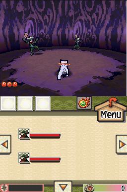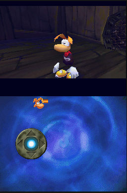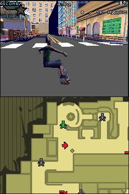

Plays roughly 40-60%? of the library fine? There's tons of accuracy issues with it, but I'm fairly happy with it for now.

### Known issues
- Rendering inaccuracies. Games still look good! Wireframe polys unsupported, anti-aliasing unsupported, fog table...
- Various game issues
- Sound sometimes seems a little...uneven?

## Master System/Game Gear/SG1000
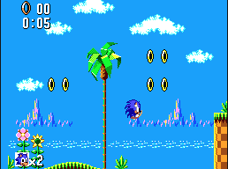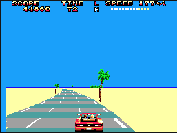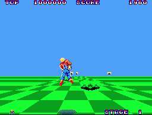
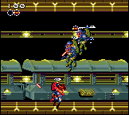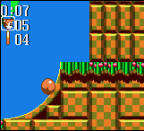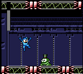
Pretty good compatability, with sound.

## PlayStation 1
GPU, CPU pass all tests. Runs homebrew fine. No CDROM core yet, no audio.

### Known Issues
- No CDROM
- GTE fails some obscure corner case for one instruction

## Super NES
Runs a few games. In a weird spot. Has sound core that works well.

### Known Issues
- HDMA is messed up. This is the main problem it's currently facing.
- PPU windows not implemented
- PPU mosaic not implemented

## TurboGraFX-16
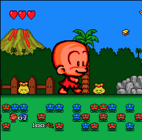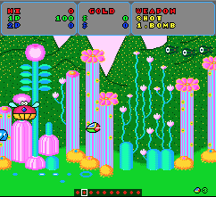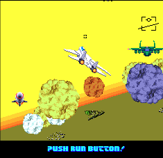

Currently very WIP core. Has lowest-level timing of any emulator I've seen the source to. A decent portion of games work and sound mostly? works.

### Known Issues
- Detana Twinbee, Gradius, Alien Crush do not work
- Bonk's Adventure and Dungeon Explorer garbled tiles
- Legendary Axe 2 crashes after menu
- Neutopia has serious issues

## ZX Spectrum
Mostly plays games fine, but not thoroughly tested

More detailed info on each to come!

## Build status

